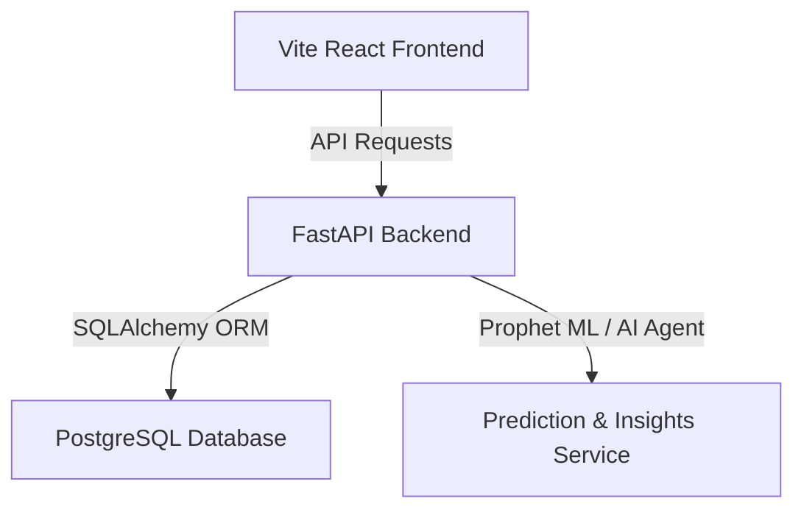

# HospitalIQ AI 🚑

HospitalIQ AI is an enterprise-grade hospital management dashboard and analytics platform. It leverages AI copilot features (natural language database querying), predictive forecasting (ML-driven occupancy and revenue metrics), and HIPAA-compliant executive summarizations to help hospital administrators optimize resources and care quality.

---

## Architecture Overview

The system is split into two main layers:



### 1. Frontend
* **Core**: React 19 (Single Page Application)
* **Build Tool**: Vite
* **Styling**: Tailwind CSS v4 (Vanilla CSS variables configuration)
* **Routing**: React Router v7
* **Charts**: Recharts
* **State/Data Fetching**: Axios + TanStack React Query v5

### 2. Backend
* **Web Framework**: FastAPI (Python 3.10+)
* **Database Access**: SQLAlchemy (Object Relational Mapper)
* **Authentication**: JWT (JSON Web Tokens) with Bcrypt password hashing
* **Task Automation**: Seed scripts for local admin population

---

## Local Setup & Development

### 1. Backend Setup
1. Navigate to the backend directory:
   ```bash
   cd backend
   ```
2. Create and activate a Python virtual environment:
   ```bash
   python -m venv venv
   # On Windows:
   .\venv\Scripts\activate
   # On macOS/Linux:
   source venv/bin/activate
   ```
3. Install dependencies:
   ```bash
   pip install -r requirements.txt
   ```
4. Copy the `.env.example` template to `.env` and fill in your details:
   ```bash
   cp .env.example .env
   ```
5. Initialize the database and seed the default administrator:
   ```bash
   python -m app.db.seed_admin
   ```
6. Start the API server:
   ```bash
   uvicorn app.main:app --reload
   ```
   The backend will be running at `http://127.0.0.1:8000`.

### 2. Frontend Setup
1. Navigate to the frontend directory:
   ```bash
   cd frontend
   ```
2. Install the packages:
   ```bash
   npm install
   ```
3. Copy the `.env.example` to `.env` and adjust the API URL to point to your local backend:
   ```bash
   cp .env.example .env
   ```
   *(Ensure `VITE_API_URL` is set to `http://127.0.0.1:8000`)*
4. Run the local dev server:
   ```bash
   npm run dev
   ```
   Open `http://localhost:5173` in your browser.

### Initial Credentials
* **User**: `admin@hospitaliq.ai`
* **Password**: `admin123`

---

## Production Deployment Guide

This project is pre-configured for direct Git integration deployments.

### 1. Database & Backend (Render)
Render is recommended for hosting the backend API and PostgreSQL database using the provided `render.yaml` infrastructure-as-code blueprint.

1. Connect your GitHub repository to [Render](https://render.com/).
2. Create a new **Blueprint** project. Render will automatically detect the `render.yaml` file in your repository root.
3. Apply the blueprint. It will automatically provision:
   * A managed **PostgreSQL Database** (`hospitaliq-db`).
   * A **Python Web Service** (`hospitaliq-api`) that installs dependencies, builds, runs migrations, and starts the FastAPI server.
4. **Environment Variables**:
   * The database link `DATABASE_URL` is linked automatically.
   * `SECRET_KEY` is generated automatically.
   * **`ALLOWED_ORIGINS`**: Once your frontend is deployed to Vercel, copy its URL and set it as the value of `ALLOWED_ORIGINS` on Render (e.g., `https://hospitaliq.vercel.app`) to authorize CORS requests.

### 2. Frontend (Vercel)
Vercel is recommended for hosting the static React/Vite frontend.

1. Connect your GitHub repository to [Vercel](https://vercel.com/).
2. Create a **New Project** and select the repository.
3. Configure the build settings:
   * **Root Directory**: `frontend`
   * **Framework Preset**: `Vite` (Vercel will auto-detect settings)
   * **Build Command**: `npm run build`
   * **Output Directory**: `dist`
4. **Environment Variables**:
   * Add a variable `VITE_API_URL` and set its value to your Render backend API URL (e.g., `https://hospitaliq-api.onrender.com`).
5. Click **Deploy**. Vercel will build and serve your app. All client-side React routes will resolve seamlessly thanks to the pre-configured `frontend/vercel.json` rewrites.
